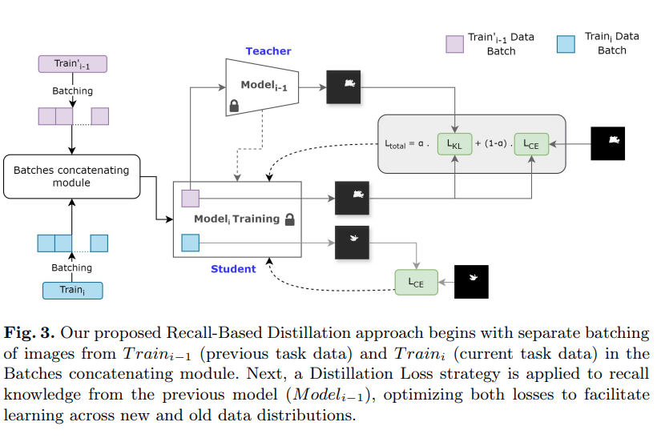

# Recall‑Based Knowledge Distillation for Incremental Segmentation Training

This repository trains an incremental **segmentation** model while reducing **catastrophic forgetting** using a *Recall-based Knowledge Distillation (KD)* strategy proposed in the following paper:  
[Recall-based Knowledge Distillation for Data Distribution Based Catastrophic Forgetting in Semantic Segmentation](https://link.springer.com/chapter/10.1007/978-3-031-78347-0_7)

In each incremental step, the model is trained on:
- **New tiles** (current domain/task), and
- A sampled subset of **Old tiles** (replayed examples from previous domain/tasks),
while using the previous model as a **teacher** on old tiles.

---

## Model Architecture
The model architecture illustrates the sequence of steps from beginning to end, detailing how the new model training takes place considering a portion of old tiles along with the new ones.

 

## What you need (inputs)

### 1) Images/tiles folders 
You will provide **three folders** containing `.npz` tiles:

- **Old tiles directory**: replay tiles from the previous training set(s)
- **New tiles directory**: tiles from the new dataset/domain you want to adapt to
- **Validation tiles directory**: tiles used for validation during training


### 2) Teacher/base model (`.keras`)
You will provide a pre-trained model checkpoint (`.keras`) that is used as:
- **Teacher** (for distillation on old tiles)
- **Initialization** for the student model (the model we continue training)

---

## Installation


If you wish to create a new environment (example with conda) you can  do so as the following:

```bash
conda create -n recall_kd python=3.11
conda activate recall_kd
```

Install dependencies:

```bash
pip install -r requirements.txt
```

---

## Tile format

Each tile must be a NumPy `.npz` file containing:
- `arr_0`: input image
- `arr_1`: segmentation mask/label
---

## Run training

Use the bash script - run_training.sh, it conatins teh folowwing content that needs to be set with the proper paths:

```
python training.py \
  --old_tiles_dir /path/to/old_tiles \
  --new_tiles_dir /path/to/new_tiles \
  --val_tiles_dir /path/to/val_tiles \
  --teacher_model /path/to/teacher_model.h5 \
  --output_dir /path/to/output_run \
  --num_old_tiles 2000 \
  --alpha 0.4 \
  --curriculum 4
```

### Key arguments
- `--num_old_tiles`: how many old tiles to sample for replay
- `--alpha`: KD weight on old tiles  
  - `0.0` = no distillation (only BCE)  
  - `1.0` = only distillation on old tiles (not recommended)
- `--curriculum`: mixing strategy for old/new batches  
  - `2` = old then new  
  - `3` = new then old  
  - `4` = interleaved batches (new, old, new, old, ...)  
  - `5` = concatenate + shuffle  
- `--output_dir`: where checkpoints + final model will be saved


---

## Outputs

Inside `--output_dir`, you will get:
- Periodic checkpoints: `unet_KD_epoch{N}.keras` (default every 5 epochs)
- Final model: `student_unet_model.keras`

---
